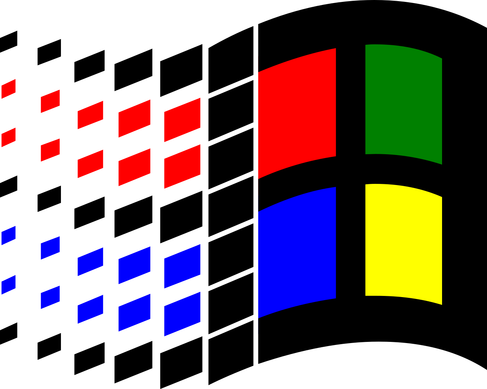

<h1 align="center">Hi 👋, I'm Przemek</h1>
<h3 align="center">I mainly develop backend, but I know HTML, CSS and JS, so I pretend to be a fullstack</h3>

<h3>About me</h3>

🌆 Living in Warsaw 
👔 Looking for a job as a software developer 
🏃 Sports: gym, running and squash 
🧩 Interests: finance, automotive, engineering, cinematography, craft beer, playing guitar 
 
📰 Blog <a href="https://kierznowski.pl">(for now, only in polish)</a> 
 
<b>Currently working on:
  <a href="https://github.com/Kierznowski/rental-app">🏢 rental-app 🏡</a> || 
  <a href="https://github.com/Kierznowski/java-2d-game">🏝️ java-2d-game 🪓</a>  
<b>Other projects: <a href="https://github.com/Kierznowski/CaffeineApp">☕ Caffeine app ☕ </a> ||<a href="https://github.com/Kierznowski/tamagotchi-js"> 🐶 Tamagotchi-js 🐶 </a>
 
 
<b>Tech stack:</b>
   

  

 
 
 
<b>Leetcode stats:</b>    

 
<b>You can reach me at:</b>
 

 
<a href="mailto:przemek.kierznowski@gmail.com" target="_blank" rel="noreferrer"> <picture>  </picture> </a>
<a href="http://www.instagram.com/kierznowski" target="_blank" rel="noreferrer"> <picture>  </picture> </a> 
<a href="https://www.linkedin.com/in/kierznowski" target="_blank" rel="noreferrer"> <picture>  </picture> </a>
<a href="https://open.spotify.com/user/11153992106?si=5daaea3528834c2d" target="_blank" rel="noreferrer"> <picture>  </picture> </a>
<a href="https://www.github.com/kierznowski" target="_blank" rel="noreferrer"> <picture> <source media="(prefers-color-scheme: dark)" srcset="https://raw.githubusercontent.com/danielcranney/readme-generator/main/public/icons/socials/github-dark.svg" /> <source media="(prefers-color-scheme: light)" srcset="https://raw.githubusercontent.com/danielcranney/readme-generator/main/public/icons/socials/github.svg" />  </picture> </a>

